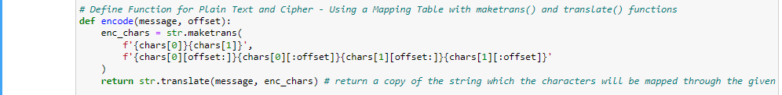
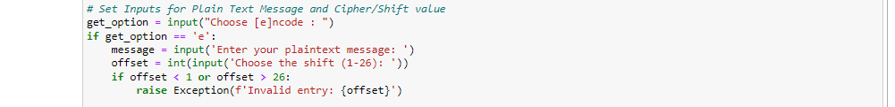

# Caesar-s-Cipher-Encryption
Caesar cipher, also known as shift cipher, is one of the simplest and most widely known encryption techniques.

## Ciphertext is encrypted text transformed from plaintext using an encryption algorithm. 
## Ciphertext can't be read until it has been converted into plaintext (decrypted) with a key.

### The following steps is one of the many ways to create a Caesar's Cipher Encryption.

1. Declare Variable of Characters - Upper and Lower Case

2. Define Function for Plain Text and Cipher

    This will be done using a mapping table with maketrans() and translate() functions.

3. The translate() function will return a copy of the string which the characters will be mapped through the given translation table.

4. Setting Inputs for Plain Text Message and Cipher/Shift value
    
    Set input for to initiate encryption. Then enter the plaintext message for to be encrypted. 

    Select a shift key to set the encryption; and by this, it should be within the 26 characters of the alphabelts varaible provided, both uppercase and lowercase. 

5. Print Out Encrypted Plain Text Message

6. Sample of encrypted plain text message

    Plain text example: Nana is a Boy

    Shift key used: 7

    Encypted message: Uhuh pz h Ivf

