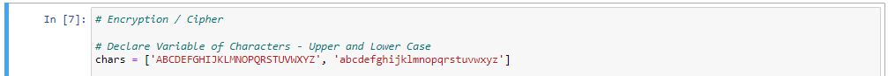

# Caesar-s-Cipher-Encryption
Caesar cipher, also known as shift cipher, is one of the simplest and most widely known encryption techniques.

## Ciphertext is encrypted text transformed from plaintext using an encryption algorithm. 
## Ciphertext can't be read until it has been converted into plaintext (decrypted) with a key.

### The following steps is one of the many ways to create a Caesar's Cipher Encryption.

1. Declare Variable of Characters - Upper and Lower Case

